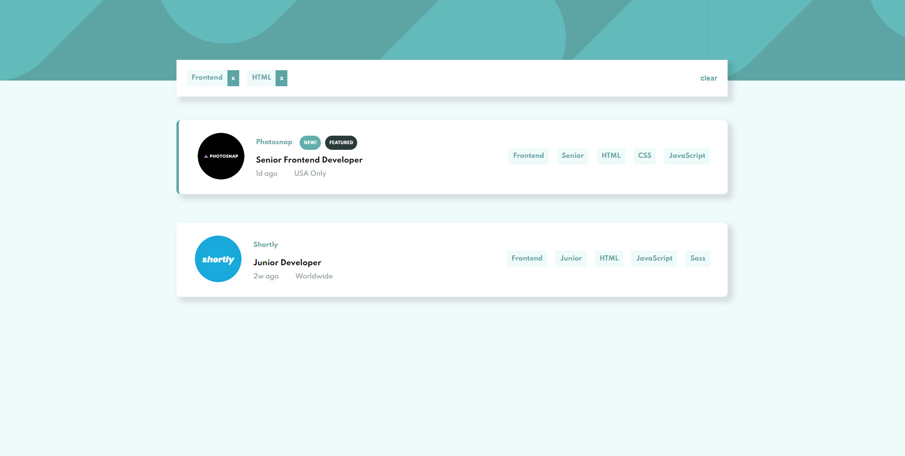
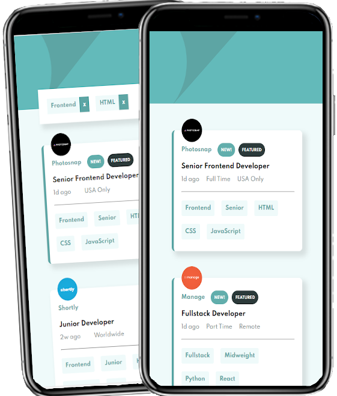

# Static Job Listings
This challenge was made by Frontend Mentor. [See live preview](https://thecargos.github.io/static-job-listing/)
## The challenge

Your challenge is to build out this job listing page and get it looking as close to the design as possible.

You can use any tools you like to help you complete the challenge. So if you've got something you'd like to practice, feel free to give it a go.

Your users should be able to:

- View the optimal layout for the site depending on their device's screen size
- See hover states for all interactive elements on the page
- Filter job listings based on the categories

# Solution

This challenge was made by Frontend Mentor. [See live preview](https://thecargos.github.io/static-job-listing/)

- Mobile First based
- BEM used

## Techs used
- HTML
- SCSS
- Vuejs

## My Screenshots
### Desktop

### Mobile

